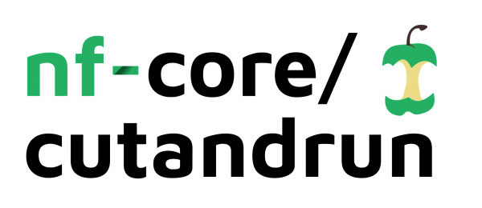

<h1>
  <picture>
    <source media="(prefers-color-scheme: dark)" srcset="docs/images/nf-core-cutandrun_logo_dark.png">
    
  </picture>
</h1>
[](https://github.com/nf-core/cutandrun/actions?query=workflow%3A%22nf-core+CI%22)
[](https://github.com/nf-core/cutandrun/actions?query=workflow%3A%22nf-core+linting%22)
[](https://nf-co.re/cutandrun/results)
[](https://doi.org/10.5281/zenodo.5653535)

[](https://www.nextflow.io/)
[](https://docs.conda.io/en/latest/)
[](https://www.docker.com/)
[](https://sylabs.io/docs/)
[](https://tower.nf/launch?pipeline=https://github.com/nf-core/cutandrun)

[](https://nfcore.slack.com/channels/cutandrun)[](https://twitter.com/nf_core)[](https://mstdn.science/@nf_core)[](https://www.youtube.com/c/nf-core)

## Introduction

**nf-core/cutandrun** is a best-practice bioinformatic analysis pipeline for CUT&RUN, CUT&Tag, and TIPseq experimental protocols that were developed to study protein-DNA interactions and epigenomic profiling.

[CUT&RUN](https://elifesciences.org/articles/46314)

> Meers, M. P., Bryson, T. D., Henikoff, J. G., & Henikoff, S. (2019). Improved CUT&RUN chromatin profiling tools. _eLife_, _8_. https://doi.org/10.7554/eLife.46314

[CUT&Tag](https://www.nature.com/articles/s41467-019-09982-5)

> Kaya-Okur, H. S., Wu, S. J., Codomo, C. A., Pledger, E. S., Bryson, T. D., Henikoff, J. G., Ahmad, K., & Henikoff, S. (2019). CUT&Tag for efficient epigenomic profiling of small samples and single cells. _Nature Communications_, _10_(1), 1930. https://doi.org/10.1038/s41467-019-09982-5]

[TIPseq](https://rupress.org/jcb/article/220/12/e202103078/212821)

> Bartlett, D. A., Dileep, V., Handa, T., Ohkawa, Y., Kimura, H., Henikoff, S., & Gilbert, D. M. (2021). High-throughput single-cell epigenomic profiling by targeted insertion of promoters (TIP-seq). Journal of Cell Biology, 220(12), e202103078. https://doi.org/10.1083/jcb.202103078

The pipeline is built using [Nextflow](https://www.nextflow.io), a workflow tool to run tasks across multiple compute infrastructures in a portable, reproducible manner. It is capable of using containerisation and package management making installation trivial and results highly reproducible. The [Nextflow DSL2](https://www.nextflow.io/docs/latest/dsl2.html) implementation of this pipeline uses one container per process, which makes it easier to maintain and update software dependencies. Where possible, these processes have been submitted to and installed from [nf-core/modules](https://github.com/nf-core/modules).

The pipeline has been developed with continuous integration (CI) and test driven development (TDD) at its core. nf-core code and module linting as well as a battery of over 100 unit and integration tests run on pull request to the main repository and on release of the pipeline. On official release, automated CI tests run the pipeline on a full-sized dataset on AWS cloud infrastructure. This ensures that the pipeline runs on AWS, has sensible resource allocation defaults set to run on real-world datasets, and permits the persistent storage of results to benchmark between pipeline releases and other analysis sources. The results obtained from the full-sized test can be viewed on the [nf-core website](https://nf-co.re/cutandrun/results).


## Pipeline summary

1. Check input files
2. Merge re-sequenced FastQ files ([`cat`](http://www.linfo.org/cat.html))
3. Read QC ([`FastQC`](https://www.bioinformatics.babraham.ac.uk/projects/fastqc/))
4. Adapter and quality trimming ([`Trim Galore!`](https://www.bioinformatics.babraham.ac.uk/projects/trim_galore/))
5. Alignment to both target and spike-in genomes ([`Bowtie 2`](http://bowtie-bio.sourceforge.net/bowtie2/index.shtml))
6. Filter on quality, sort and index alignments ([`samtools`](https://sourceforge.net/projects/samtools/files/samtools/))
7. Duplicate read marking ([`picard`](https://broadinstitute.github.io/picard/))
8. Create bedGraph files ([`bedtools`](https://github.com/arq5x/bedtools2/)
9. Create bigWig coverage files ([`bedGraphToBigWig`](http://hgdownload.soe.ucsc.edu/admin/exe/))
10. Peak calling ([`SEACR`](https://github.com/FredHutch/SEACR), [`MACS2`](https://github.com/macs3-project/MACS))
11. Consensus peak merging and reporting ([`bedtools`](https://github.com/arq5x/bedtools2/))
12. Library complexity ([preseq]([Preseq | The Smith Lab](http://smithlabresearch.org/software/preseq)))
13. Fragment-based quality control ([`deepTools`](https://github.com/deeptools/deepTools/))
14. Peak-based quality control ([`bedtools`](https://github.com/arq5x/bedtools2/), custom python)
15. Heatmap peak analysis ([`deepTools`](https://github.com/deeptools/deepTools/))
16. Genome browser session ([`IGV`](https://software.broadinstitute.org/software/igv/))
17. Present all QC in web-based report ([`MultiQC`](http://multiqc.info/))

## Usage

> [!NOTE]
> If you are new to Nextflow and nf-core, please refer to [this page](https://nf-co.re/docs/usage/installation) on how to set-up Nextflow. Make sure to [test your setup](https://nf-co.re/docs/usage/introduction#how-to-run-a-pipeline) with `-profile test` before running the workflow on actual data.

First, prepare a samplesheet with your input data that looks as follows:

`samplesheet.csv`:

```csv
group,replicate,fastq_1,fastq_2,control
h3k27me3,1,h3k27me3_rep1_r1.fastq.gz,h3k27me3_rep1_r2.fastq.gz,igg_ctrl
h3k27me3,2,h3k27me3_rep2_r1.fastq.gz,h3k27me3_rep2_r2.fastq.gz,igg_ctrl
igg_ctrl,1,igg_rep1_r1.fastq.gz,igg_rep1_r2.fastq.gz,
igg_ctrl,2,igg_rep2_r1.fastq.gz,igg_rep2_r2.fastq.gz,
```

Each row represents a pair of fastq files (paired end).

Now, you can run the pipeline using:

nextflow run nf-core/cutandrun \
 -profile <docker/singularity/.../institute> \
 --input samplesheet.csv \
 --peakcaller 'seacr,MACS2' \
 --genome GRCh38 \
 --outdir <OUTDIR>

> [!WARNING]
> Please provide pipeline parameters via the CLI or Nextflow `-params-file` option. Custom config files including those provided by the `-c` Nextflow option can be used to provide any configuration _**except for parameters**_;
> see [docs](https://nf-co.re/usage/configuration#custom-configuration-files).

- Typical command for CUT&Run/CUT&Tag/TIPseq analysis:

## Pipeline output

To see the the results of a test run with a full size dataset refer to the [results](https://nf-co.re/cutandrun/results) tab on the nf-core website pipeline page.
For more details about the output files and reports, please refer to the
[output documentation](https://nf-co.re/cutandrun/output).

## Credits

nf-core/cutandrun was originally written by Chris Cheshire ([@chris-cheshire](https://github.com/chris-cheshire)) and Charlotte West ([@charlotte-west](https://github.com/charlotte-west)) from [Luscombe Lab](https://www.crick.ac.uk/research/labs/nicholas-luscombe) at [The Francis Crick Institute](https://www.crick.ac.uk/), London, UK.

The pipeline structure and parts of the downstream analysis were adapted from the original CUT&Tag analysis [protocol](https://yezhengstat.github.io/CUTTag_tutorial/) from the [Henikoff Lab](https://research.fredhutch.org/henikoff/en.html). The removal of duplicates arising from linear amplification (also known as T7 duplicates) in the TIPseq protocol was implemented as described in the original [TIPseq paper](https://rupress.org/jcb/article/220/12/e202103078/212821).

We thank Harshil Patel ([@drpatelh](https://github.com/drpatelh)) and everyone in the Luscombe Lab ([@luslab](https://github.com/luslab)) for their extensive assistance in the development of this pipeline.

](docs/images/crick_logo.png)

## Contributions and Support

If you would like to contribute to this pipeline, please see the [contributing guidelines](.github/CONTRIBUTING.md).

For further information or help, don't hesitate to get in touch on the [Slack `#cutandrun` channel](https://nfcore.slack.com/channels/cutandrun) (you can join with [this invite](https://nf-co.re/join/slack)).

## Citations

If you use nf-core/cutandrun for your analysis, please cite it using the following doi: [10.5281/zenodo.5653535](https://doi.org/10.5281/zenodo.5653535)

An extensive list of references for the tools used by the pipeline can be found in the [`CITATIONS.md`](CITATIONS.md) file.

You can cite the `nf-core` publication as follows:

> **The nf-core framework for community-curated bioinformatics pipelines.**
>
> Philip Ewels, Alexander Peltzer, Sven Fillinger, Harshil Patel, Johannes Alneberg, Andreas Wilm, Maxime Ulysse Garcia, Paolo Di Tommaso & Sven Nahnsen.
>
> _Nat Biotechnol._ 2020 Feb 13. doi: [10.1038/s41587-020-0439-x](https://dx.doi.org/10.1038/s41587-020-0439-x).
