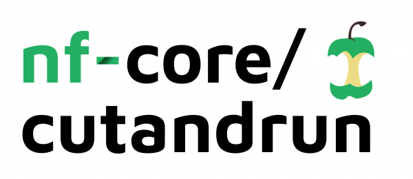

<h1>
  <picture>
    <source media="(prefers-color-scheme: dark)" srcset="docs/images/nf-core-cutandrun_logo_dark.png">
    
  </picture>
</h1>

 [](https://www.nextflow.io/)
[](https://docs.conda.io/en/latest/)
[](https://www.docker.com/)
[](https://sylabs.io/docs/)
[](https://tower.nf/launch?pipeline=https://github.com/nf-core/cutandrun)

[](https://nfcore.slack.com/channels/cutandrun)[](https://twitter.com/nf_core)[](https://mstdn.science/@nf_core)[](https://www.youtube.com/c/nf-core)

## Table of Contents

- [Introduction](#introduction)
- [Pipeline Summary](#pipeline-summary)
- [Prerequisites](#prerequisites)
- [Quick Start](#quick-start)
- [Usage](#usage)
- [Testing the Pipeline](#testing-the-pipeline)
- [Documentation](#documentation)
- [Pipeline Output](#pipeline-output)
- [Credits](#credits)
- [Contributions and Support](#contributions-and-support)
- [Citations](#citations)

## Introduction

**nf-core/cutandrun** is a best-practice bioinformatic analysis pipeline for CUT&RUN, CUT&Tag, and TIPseq experimental protocols that were developed to study protein-DNA interactions and epigenomic profiling.

[CUT&RUN](https://elifesciences.org/articles/46314)

> Meers, M. P., Bryson, T. D., Henikoff, J. G., & Henikoff, S. (2019). Improved CUT&RUN chromatin profiling tools. _eLife_, _8_. https://doi.org/10.7554/eLife.46314

[CUT&Tag](https://www.nature.com/articles/s41467-019-09982-5)

> Kaya-Okur, H. S., Wu, S. J., Codomo, C. A., Pledger, E. S., Bryson, T. D., Henikoff, J. G., Ahmad, K., & Henikoff, S. (2019). CUT&Tag for efficient epigenomic profiling of small samples and single cells. _Nature Communications_, _10_(1), 1930. https://doi.org/10.1038/s41467-019-09982-5]

[TIPseq](https://rupress.org/jcb/article/220/12/e202103078/212821)

> Bartlett, D. A., Dileep, V., Handa, T., Ohkawa, Y., Kimura, H., Henikoff, S., & Gilbert, D. M. (2021). High-throughput single-cell epigenomic profiling by targeted insertion of promoters (TIP-seq). Journal of Cell Biology, 220(12), e202103078. https://doi.org/10.1083/jcb.202103078

The pipeline is built using [Nextflow](https://www.nextflow.io), a workflow tool to run tasks across multiple compute infrastructures in a portable, reproducible manner. It is capable of using containerisation and package management making installation trivial and results highly reproducible. The [Nextflow DSL2](https://www.nextflow.io/docs/latest/dsl2.html) implementation of this pipeline uses one container per process, which makes it easier to maintain and update software dependencies. Where possible, these processes have been submitted to and installed from [nf-core/modules](https://github.com/nf-core/modules).

The pipeline has been developed with continuous integration (CI) and test driven development (TDD) at its core. nf-core code and module linting as well as a battery of over 100 unit and integration tests run on pull request to the main repository and on release of the pipeline. On official release, automated CI tests run the pipeline on a full-sized dataset on AWS cloud infrastructure. This ensures that the pipeline runs on AWS, has sensible resource allocation defaults set to run on real-world datasets, and permits the persistent storage of results to benchmark between pipeline releases and other analysis sources. The results obtained from the full-sized test can be viewed on the [nf-core website](https://nf-co.re/cutandrun/results).


## Pipeline summary

1. Check input files
2. Merge re-sequenced FastQ files ([`cat`](http://www.linfo.org/cat.html))
3. Read QC ([`FastQC`](https://www.bioinformatics.babraham.ac.uk/projects/fastqc/))
4. Adapter and quality trimming ([`Trim Galore!`](https://www.bioinformatics.babraham.ac.uk/projects/trim_galore/))
5. Alignment to both target and spike-in genomes ([`Bowtie 2`](http://bowtie-bio.sourceforge.net/bowtie2/index.shtml))
6. Filter on quality, sort and index alignments ([`samtools`](https://sourceforge.net/projects/samtools/files/samtools/))
7. Duplicate read marking ([`picard`](https://broadinstitute.github.io/picard/))
8. Create bedGraph files ([`bedtools`](https://github.com/arq5x/bedtools2/)
9. Create bigWig coverage files ([`bedGraphToBigWig`](http://hgdownload.soe.ucsc.edu/admin/exe/))
10. Peak calling ([`SEACR`](https://github.com/FredHutch/SEACR), [`MACS2`](https://github.com/macs3-project/MACS))
11. Consensus peak merging and reporting ([`bedtools`](https://github.com/arq5x/bedtools2/))
12. Library complexity ([preseq]([Preseq | The Smith Lab](http://smithlabresearch.org/software/preseq)))
13. Fragment-based quality control ([`deepTools`](https://github.com/deeptools/deepTools/))
14. Peak-based quality control ([`bedtools`](https://github.com/arq5x/bedtools2/), custom python)
15. Heatmap peak analysis ([`deepTools`](https://github.com/deeptools/deepTools/))
16. Genome browser session ([`IGV`](https://software.broadinstitute.org/software/igv/))
17. Present all QC in web-based report ([`MultiQC`](http://multiqc.info/))

## Prerequisites

To run this pipeline, you only need to install:

1. **Nextflow** (version ≥23.04.0)
   - Follow the installation instructions at [nextflow.io](https://www.nextflow.io/docs/latest/getstarted.html#installation)
   - Or use the nf-core [installation guide](https://nf-co.re/docs/usage/installation)

2. **A container engine** (choose one):
   - [Docker](https://docs.docker.com/get-docker/)
   - [Singularity](https://sylabs.io/guides/latest/user-guide/)
   - [Podman](https://podman.io/getting-started/installation)

> [!NOTE]
> All other software dependencies (alignment tools, peak callers, QC tools, etc.) are automatically handled by the pipeline through containers, You do not need to install them manually.

For institutional cluster users, check if your institution has a custom nf-core configuration profile available at [nf-core/configs](https://github.com/nf-core/configs).

## Quick Start

1. **Install Nextflow and a container engine** (see [Prerequisites](#prerequisites))

2. **Test the pipeline** with the included test dataset:

   ```bash
   nextflow run nf-core/cutandrun -profile test,docker --outdir results
   ```

3. **Prepare your samplesheet** (see [Usage](#usage) for format details)

4. **Run the pipeline** with your data:

   ```bash
   nextflow run nf-core/cutandrun \
     -profile docker \
     --input samplesheet.csv \
     --genome GRCh38 \
     --outdir results
   ```

5. **Explore the results** in the output directory and review the MultiQC report

For more detailed instructions, see the [full documentation](https://nf-co.re/cutandrun).

## Usage

> [!NOTE]
> If you are new to Nextflow and nf-core, please refer to [this page](https://nf-co.re/docs/usage/installation) on how to set-up Nextflow. Make sure to [test your setup](https://nf-co.re/docs/usage/introduction#how-to-run-a-pipeline) with `-profile test` before running the workflow on actual data.

First, prepare a samplesheet with your input data that looks as follows:

`samplesheet.csv`:

```csv
group,replicate,fastq_1,fastq_2,control
h3k27me3,1,h3k27me3_rep1_r1.fastq.gz,h3k27me3_rep1_r2.fastq.gz,igg_ctrl
h3k27me3,2,h3k27me3_rep2_r1.fastq.gz,h3k27me3_rep2_r2.fastq.gz,igg_ctrl
igg_ctrl,1,igg_rep1_r1.fastq.gz,igg_rep1_r2.fastq.gz,
igg_ctrl,2,igg_rep2_r1.fastq.gz,igg_rep2_r2.fastq.gz,
```

Each row represents a pair of fastq files (paired end).

### Basic Command

Now, you can run the pipeline using:

```bash
nextflow run nf-core/cutandrun \
  -profile <docker/singularity/.../institute> \
  --input samplesheet.csv \
  --peakcaller 'seacr,MACS2' \
  --genome GRCh38 \
  --outdir <OUTDIR>
```

> [!WARNING]
> Please provide pipeline parameters via the CLI or Nextflow `-params-file` option. Custom config files including those provided by the `-c` Nextflow option can be used to provide any configuration _**except for parameters**_;
> see [docs](https://nf-co.re/usage/configuration#custom-configuration-files).

### Example Commands

**CUT&Run/CUT&Tag analysis with SEACR and MACS2 peak calling:**

```bash
nextflow run nf-core/cutandrun \
  -profile docker \
  --input samplesheet.csv \
  --peakcaller 'seacr,MACS2' \
  --genome GRCh38 \
  --outdir results
```

**TIPseq analysis with linear duplicate removal:**

```bash
nextflow run nf-core/cutandrun \
  -profile docker \
  --input samplesheet.csv \
  --peakcaller 'seacr' \
  --genome GRCh38 \
  --use_linear_dedup \
  --outdir results
```

For more usage examples and parameter details, see the [usage documentation](https://nf-co.re/cutandrun/usage).

## Testing the Pipeline

It is recommended to test the pipeline with the included test dataset before running it on your own data.

### Running the Test Profile

```bash
nextflow run nf-core/cutandrun -profile test,docker --outdir test_results
```

This will:
- Download a small test dataset automatically
- Run the complete pipeline workflow
- Complete in approximately 10-15 minutes (depending on your system)
- Generate output in the `test_results` directory

### Available Test Profiles

The pipeline includes several test profiles for different scenarios:

- `test` - Basic test with small dataset
- `test_full` - Full-sized dataset test
- `test_no_control` - Test without control samples
- `test_tech_reps` - Test with technical replicates

For example:
```bash
nextflow run nf-core/cutandrun -profile test_full,docker --outdir results
```

For more information on testing, see the [nf-core documentation](https://nf-co.re/docs/usage/introduction#how-to-run-a-pipeline).

## Documentation

Comprehensive documentation for nf-core/cutandrun is available on the nf-core website:

**📚 [https://nf-co.re/cutandrun](https://nf-co.re/cutandrun)**

The documentation includes:

- **[Usage Guide](https://nf-co.re/cutandrun/usage)** - Detailed instructions on running the pipeline
- **[Parameters](https://nf-co.re/cutandrun/parameters)** - Complete list of all pipeline parameters
- **[Output Documentation](https://nf-co.re/cutandrun/output)** - Description of all output files and reports
- **[Results](https://nf-co.re/cutandrun/results)** - Example results from full-sized test dataset

## Pipeline Output

The pipeline generates comprehensive outputs including:

- Quality control reports (FastQC, MultiQC)
- Alignment files (BAM files, coverage tracks)
- Peak calls (SEACR, MACS2)
- Consensus peaks and reproducibility analysis
- Heatmaps and genome browser sessions

To see example results from a full-sized dataset, visit:
- **[Example Results](https://nf-co.re/cutandrun/results)** - Full test run outputs on AWS

For detailed descriptions of all output files and reports, see:
- **[Output Documentation](https://nf-co.re/cutandrun/output)** - Complete output file reference

## Credits

nf-core/cutandrun was originally written by Chris Cheshire ([@chris-cheshire](https://github.com/chris-cheshire)) and Charlotte West ([@charlotte-west](https://github.com/charlotte-west)) from [Luscombe Lab](https://www.crick.ac.uk/research/labs/nicholas-luscombe) at [The Francis Crick Institute](https://www.crick.ac.uk/), London, UK.

The pipeline structure and parts of the downstream analysis were adapted from the original CUT&Tag analysis [protocol](https://yezhengstat.github.io/CUTTag_tutorial/) from the [Henikoff Lab](https://research.fredhutch.org/henikoff/en.html). The removal of duplicates arising from linear amplification (also known as T7 duplicates) in the TIPseq protocol was implemented as described in the original [TIPseq paper](https://rupress.org/jcb/article/220/12/e202103078/212821).

We thank Harshil Patel ([@drpatelh](https://github.com/drpatelh)) and everyone in the Luscombe Lab ([@luslab](https://github.com/luslab)) for their extensive assistance in the development of this pipeline.

](docs/images/crick_logo.png)

## Contributions and Support

If you would like to contribute to this pipeline, please see the [contributing guidelines](.github/CONTRIBUTING.md).

For further information or help, don't hesitate to get in touch on the [Slack `#cutandrun` channel](https://nfcore.slack.com/channels/cutandrun) (you can join with [this invite](https://nf-co.re/join/slack)).

## Citations

If you use nf-core/cutandrun for your analysis, please cite it using the following doi: [10.5281/zenodo.5653535](https://doi.org/10.5281/zenodo.5653535)

An extensive list of references for the tools used by the pipeline can be found in the [`CITATIONS.md`](CITATIONS.md) file.

You can cite the `nf-core` publication as follows:

> **The nf-core framework for community-curated bioinformatics pipelines.**
>
> Philip Ewels, Alexander Peltzer, Sven Fillinger, Harshil Patel, Johannes Alneberg, Andreas Wilm, Maxime Ulysse Garcia, Paolo Di Tommaso & Sven Nahnsen.
>
> _Nat Biotechnol._ 2020 Feb 13. doi: [10.1038/s41587-020-0439-x](https://dx.doi.org/10.1038/s41587-020-0439-x).
