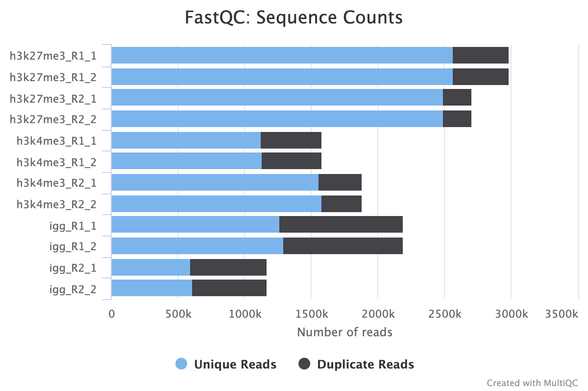
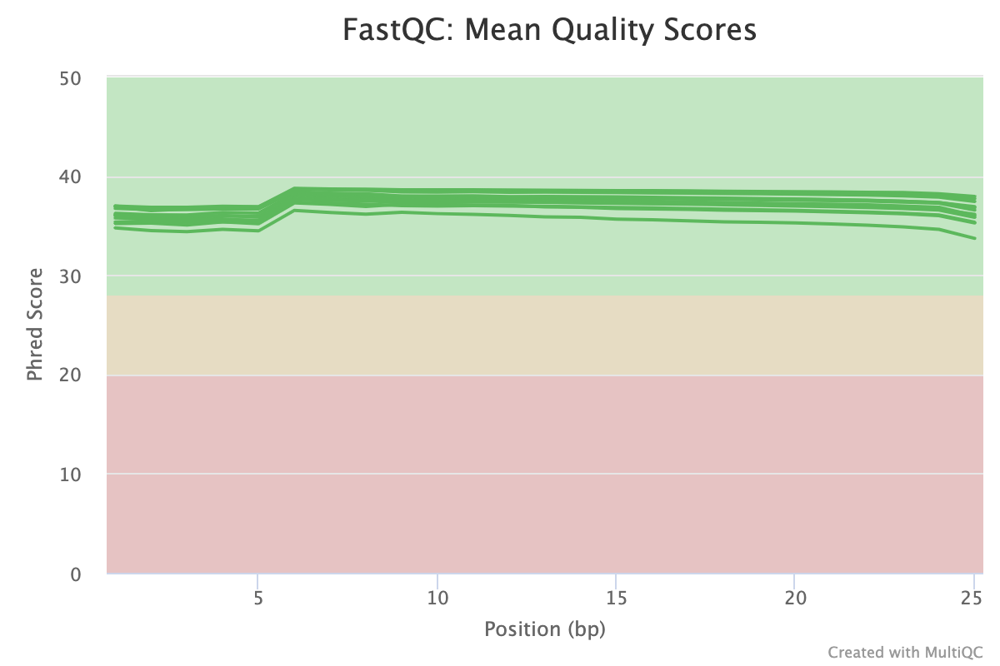
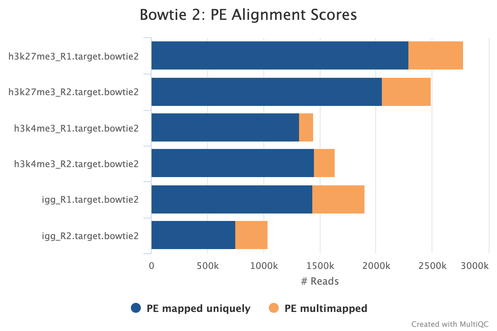
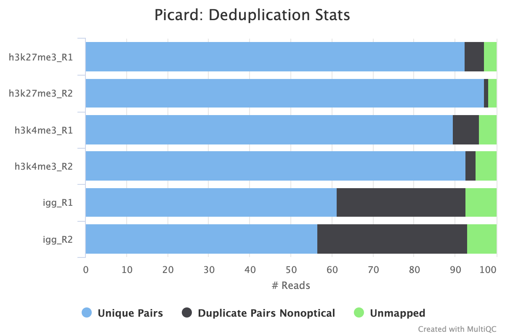
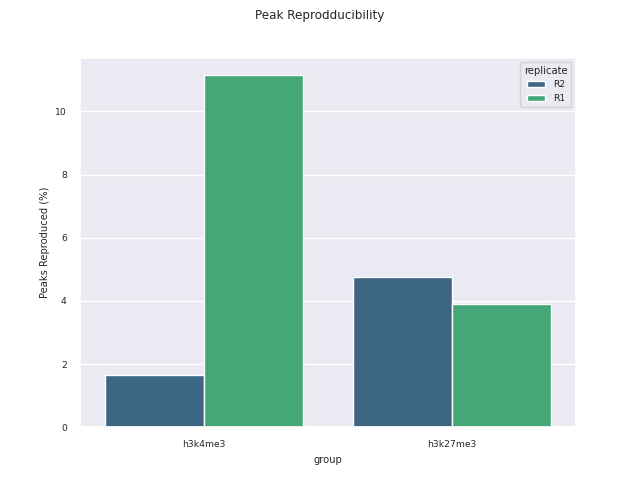
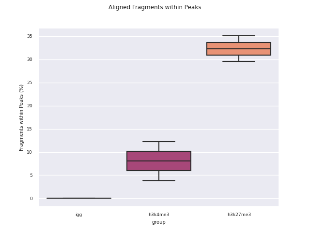
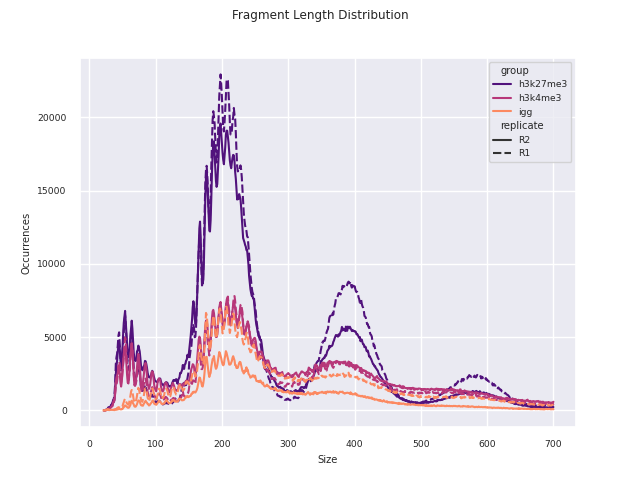

# nf-core/cutandrun: Output

## Introduction

This document describes the output produced by the pipeline. Example plots are taken from the pdf report which details summary details and analyses specific to CUT&Run/CUT&Tag data, and the MultiQC report, which summarises results from some tools used, at the end of the pipeline.

The directories listed below will be created in the results directory after the pipeline has finished. All paths are relative to the top-level results directory.

## Pipeline overview

The pipeline is built using [Nextflow](https://www.nextflow.io/) and processes data using the following steps:

- [nf-core/cutandrun: Output](#nf-corecutandrun-output)
  - [Introduction](#introduction)
  - [Pipeline overview](#pipeline-overview)
  - [Preprocessing](#preprocessing)
    - [Samplesheet check](#samplesheet-check)
    - [Fastq merging](#fastq-merging)
    - [FastQC](#fastqc)
    - [TrimGalore](#trimgalore)
  - [Alignment](#alignment)
    - [Bowtie 2](#bowtie-2)
  - [Alignment post-processing](#alignment-post-processing)
    - [samtools](#samtools)
    - [picard MarkDuplicates/RemoveDuplicates](#picard-markduplicatesremoveduplicates)
  - [Peak Calling](#peak-calling)
    - [Bam to bedgraph](#bam-to-bedgraph)
    - [Clip bedfiles](#clip-bedfiles)
    - [Bed to bigwig](#bed-to-bigwig)
    - [SEACR peak calling](#seacr-peak-calling)
    - [BEDtools](#bedtools)
  - [Reporting](#reporting)
    - [Python reporting](#python-reporting)
    - [MultiQC](#multiqc)
    - [IGV](#igv)
    - [Deeptools](#deeptools)
  - [Workflow reporting and genomes](#workflow-reporting-and-genomes)
    - [Reference genome files](#reference-genome-files)
    - [Pipeline information](#pipeline-information)

## Preprocessing

### Samplesheet check

The first step of the pipeline is to verify the samplesheet structure and experimental design to ensure that it is valid.

### Fastq merging

Output files

- `01_prealign/merged_fastq/`
  - `*.merged.fastq.gz`: If `--save_merged_fastq` is specified, concatenated FastQ files will be placed in this directory.

If multiple libraries/runs have been provided for the same sample in the input samplesheet (e.g. to increase sequencing depth) then these will be merged at the very beginning of the pipeline in order to have consistent sample naming throughout the pipeline. Please refer to the [usage documentation](https://nf-co.re/rnaseq/usage#samplesheet-input) to see how to specify these samples in the input samplesheet.

### FastQC

Output files

- `01_prealign/pretrim_fastqc/`
  - `*_fastqc.html`: FastQC report containing quality metrics.
  - `*_fastqc.zip`: Zip archive containing the FastQC report, tab-delimited data file and plot images.

> **NB:** The FastQC plots in this directory are generated relative to the raw, input reads. They may contain adapter sequence and regions of low quality. To see how your reads look after adapter and quality trimming please refer to the FastQC reports in the `01_prealign/trimgalore/fastqc/` directory.

[FastQC](http://www.bioinformatics.babraham.ac.uk/projects/fastqc/) gives general quality metrics about your sequenced reads. It provides information about the quality score distribution across your reads, per base sequence content (%A/T/G/C), adapter contamination and overrepresented sequences. For further reading and documentation see the [FastQC help pages](http://www.bioinformatics.babraham.ac.uk/projects/fastqc/Help/).

### TrimGalore

Output files

- `01_prealign/trimgalore/`
  - `*.fq.gz`: If `--save_trimmed` is specified, FastQ files **after** adapter trimming will be placed in this directory.
  - `*_trimming_report.txt`: Log file generated by Trim Galore!.
- `01_prealign/trimgalore/fastqc/`
  - `*_fastqc.html`: FastQC report containing quality metrics for read 1 (_and read2 if paired-end_) **after** adapter trimming.
  - `*_fastqc.zip`: Zip archive containing the FastQC report, tab-delimited data file and plot images.

[Trim Galore!](https://www.bioinformatics.babraham.ac.uk/projects/trim_galore/) is a wrapper tool around Cutadapt and FastQC to perform quality and adapter trimming on FastQ files. By default, Trim Galore! will automatically detect and trim the appropriate adapter sequence.

> **NB:** TrimGalore! will only run using multiple cores if you are able to use more than > 5 and > 6 CPUs for single- and paired-end data, respectively. The total cores available to TrimGalore! will also be capped at 4 (7 and 8 CPUs in total for single- and paired-end data, respectively) because there is no longer a run-time benefit. See [release notes](https://github.com/FelixKrueger/TrimGalore/blob/master/Changelog.md#version-060-release-on-1-mar-2019) and [discussion whilst adding this logic to the nf-core/atacseq pipeline](https://github.com/nf-core/atacseq/pull/65).

## Alignment

### Bowtie 2

Output files

- `02_alignment/bowtie2`

Adapter-trimmed reads are mapped to the target and spike-in genomes using [Bowtie 2](http://bowtie-bio.sourceforge.net/bowtie2/index.shtml). A genome index is required to run Bowtie2 which is created automatically from the genome fasta input.

The pipeline will output the `.bam` files with index and samtools stats for only the final set by default. For example, the full pipeline will only output picard duplicates processed files as this is the final step before peak calling. If the pipeline is run with `--only_align`, then the `bam` files from the initial sorting and indexing will be copied to the output directory as the other steps are not run.

If `--save_align_intermed` is specified then all the `bam` files from all stages will be copied over to the output directory.

If `--save_spikein_aligned` is specified then the spike-in alignment files will also be published.

## Alignment post-processing

### samtools

Output files

- `aligner/bowtie2/intermediate/`
  - `.filtered.bam`: If `--publish_align_intermeds` is specified the original BAM file containing read alignments to the target genome will be placed in this directory.
  - `.filtered.bam.bai`: BAI file for BAM.
- `aligner/bowtie2/intermediate/samtools_stats`
  - `.filtered.bam.*stats`: various statistics regarding the BAM files.

BAM files are filtered for a minimum quality score of 0 using [SAMtools](http://samtools.sourceforge.net/).

### picard MarkDuplicates/RemoveDuplicates

Output files

- `02_alignment/bowtie2/target/markdup/`
  - `.markdup.bam`: Coordinate sorted BAM file after duplicate marking. This is the final post-processed BAM file and so will be saved by default in the results directory.
  - `.markdup.bam.bai`: BAI index file for coordinate sorted BAM file after duplicate marking. This is the final post-processed BAM index file and so will be saved by default in the results directory.
- `02_alignment/bowtie2/target/markdup/picard_metrics`
  - `.markdup.MarkDuplicates.metrics.txt`: Metrics file from MarkDuplicates.

By default, the pipeline uses [picard MarkDuplicates](https://broadinstitute.github.io/picard/command-line-overview.html#MarkDuplicates) to _mark_ the duplicate reads identified amongst the alignments to allow you to gauge the overall level of duplication in your samples.

If your data includes IgG controls, these will additionally be de-duplicated. It is not the normal protocol to de-duplicate the target reads, however, if this is required, use the `--dedup_target_reads true` switch.

## Peak Calling

### Bam to bedgraph

Output files

- `03_peak_calling/01_bam_to_bedgraph`
  - `*.bedgraph`: bedgraph coverage file.

Converts bam files to the bedgraph format.

### Clip bedfiles

### Bed to bigwig

Output files

- `03_peak_calling/03_bed_to_bigwig`
  - `*.bigWig`: bigWig coverage file.

The [bigWig](https://genome.ucsc.edu/goldenpath/help/bigWig.html) format is an indexed binary format useful for displaying dense, continuous data in Genome Browsers such as the [UCSC](https://genome.ucsc.edu/cgi-bin/hgTracks) and [IGV](http://software.broadinstitute.org/software/igv/). This mitigates the need to load the much larger BAM files for data visualisation purposes which will be slower and result in memory issues. The bigWig format is also supported by various bioinformatics software for downstream processing such as meta-profile plotting.

### SEACR peak calling

Output files

- `03_peak_calling/04_called_peaks/`
  - `.peaks*.bed`: BED file containing peak coordinates and peak signal.

[SEACR](https://github.com/FredHutch/SEACR) is a peak caller for data with low background-noise, so is well suited to CUT&Run/CUT&Tag data. SEACR can take in IgG control bedGraph files in order to avoid calling peaks in regions of the experimental data for which the IgG control is enriched. If `--igg_control false` is specified, SEACR calls enriched regions in target data by selecting the top 5% of regions by AUC by default. This threshold can be overwritten using `--peak_threshold`.

### Bedtools

Output files

- `seacr/`
  - `{group}.consensus_peaks.pdf`: schematic showing which consensus peaks are shared across replicates within groups
  - `all_peaks.consensus_peaks.pdf`: schematic showing which consensus peaks are shared across all samples
- `seacr/consensus_peaks`
  - `{group}.consensus.peaks.bed`: BED containing consensus peaks for each group
  - `all_peaks.consensus.peaks.bed`: BED containing consensus peaks across all samples

The merge function from [BEDtools](https://github.com/arq5x/bedtools2) is used to merge replicate peaks of the same experimental group to create a consensus peak set. This can then optionally be filtered for consensus peaks contributed to be a threshold number of replicates using `--replicate_threshold`. Additionally, the same workflow is run merging across all samples.

##  Reporting

### Python reporting

Output files

- `04_reporting/qc/`
  - `report.pdf`: PDF report of all plots.
  - `*.png`: individual plots featured in the PDF report.
  - `*.csv`: corresponding data used to produce the plot.

Additional QC and analysis pertaining particularly to CUT&Run and CUT&Tag data are reported in this module. This report was adapted in python from the original CUT&Tag analysis [protocol](https://yezhengstat.github.io/CUTTag_tutorial/) from the [Henikoff Lab](https://research.fredhutch.org/henikoff/en.html).

### MultiQC

[MultiQC](http://multiqc.info) is a visualization tool that generates a single HTML report summarizing all samples in your project. Most of the pipeline QC results are visualised in the report and further statistics are available in the report data directory.

> **NB:** The FastQC plots displayed in the MultiQC report shows **untrimmed** reads. They may contain adapter sequence and potentially regions with low quality.

Output files

- `04_reporting/multiqc/`
  - `multiqc_report.html`: a standalone HTML file that can be viewed in your web browser.
  - `multiqc_data/`: directory containing parsed statistics from the different tools used in the pipeline.
  - `multiqc_plots/`: directory containing static images from the report in various formats.

### IGV

Output files

- `04_reporting/igv/`
  - `igv_session.xml`: IGV session.
  - `*.txt`: IGV input file configurations.

An IGV session file will be created at the end of the pipeline containing the normalised bigWig tracks, per-sample peaks, target genome fasta and annotation GTF. Once installed, open IGV, go to File > Open Session and select the igv_session.xml file for loading.

> **NB:** If you are not using an in-built genome provided by IGV you will need to load the annotation yourself e.g. in .gtf and/or .bed format.

### Deeptools

Output files

- `04_reporting/heatmaps/<gene/peak>/`
  - `.plotHeatmap.pdf`: heatmap PDF.
  - `.computeMatrix.mat.gz`: heatmap matrix.
  - `*.mat.tab`: matrix and heatmap configs.

[deeptools](https://github.com/deeptools/deepTools/) sub-tools computeMatrix and plotHeatmap are used to assess the distribution of fragments around genes and peaks.

## Workflow reporting and genomes

### Reference genome files

Output files

- `00_genome/target/`
  - `*.fa`: If the `--save_reference` parameter is provided then all of the genome reference files will be placed in this directory.
- `00_genome/target/index/`
  - `bowtie2`: Directory containing target Bowtie2 indices.
- `00_genome/spikein/index/`
  - `bowtie2`: Directory containing spike-in Bowtie2 indices.

A number of genome-specific files are generated by the pipeline because they are required for the downstream processing of the results. If the `--save_reference` parameter is provided then these will be saved in the `00_genome/` directory. It is recommended to use the `--save_reference` parameter if you are using the pipeline to build new indices so that you can save them somewhere locally. The index building step can be quite a time-consuming process and it permits their reuse for future runs of the pipeline to save disk space.

### Pipeline information

Output files

- `pipeline_info/`
  - Reports generated by Nextflow: `execution_report.html`, `execution_timeline.html`, `execution_trace.txt` and `pipeline_dag.dot`/`pipeline_dag.svg`.
  - Reports generated by the pipeline: `pipeline_report.html`, `pipeline_report.txt` and `software_versions.yml`. The `pipeline_report*` files will only be present if the `--email` / `--email_on_fail` parameter's are used when running the pipeline.
  - Reformatted samplesheet files used as input to the pipeline: `samplesheet.valid.csv`.

[Nextflow](https://www.nextflow.io/docs/latest/tracing.html) provides excellent functionality for generating various reports relevant to the running and execution of the pipeline. This will allow you to troubleshoot errors with the running of the pipeline, and also provide you with other information such as launch commands, run times and resource usage.
