<!-- vscode-markdown-toc -->

- 1. [Introduction](#Introduction)
- 2. [Preprocessing](#Preprocessing)
     - 2.1. [Sample Sheet Check](#SampleSheetCheck)
     - 2.2. [FASTQ Merging](#FASTQMerging)
     - 2.3. [FastQC](#FastQC)
     - 2.4. [Sequence Counts](#SequenceCounts)
       - 2.4.1. [Sequence Quality](#SequenceQuality)
       - 2.4.2. [Overrepresented Sequences](#OverrepresentedSequences)
     - 2.5. [TrimGalore](#TrimGalore)
- 3. [Alignment](#Alignment)
     - 3.1. [Bowtie 2](#Bowtie2)
     - 3.2. [Library Complexity](#LibraryComplexity)
- 4. [Alignment post-processing](#Alignmentpost-processing)
     - 4.1. [Quality Filtering](#QualityFiltering)
     - 4.2. [PICARD MarkDuplicates/RemoveDuplicates](#PICARDMarkDuplicatesRemoveDuplicates)
     - 4.3. [Removing Linear Amplification Duplicates](#CUSTOMLinearAmplificationDeduplication)
- 5. [Fragment-based QC](#Fragment-basedQC)
     - 5.1. [PCA](#PCA)
     - 5.2. [Fingerprint](#Fingerprint)
     - 5.3. [Correlation](#Correlation)
- 6. [Peak Calling](#PeakCalling)
     - 6.1. [Bam to bedgraph](#Bamtobedgraph)
     - 6.2. [Bed to bigwig](#Bedtobigwig)
     - 6.3. [SEACR peak calling](#SEACRpeakcalling)
     - 6.4. [MACS2 peak calling](#MACS2peakcalling)
     - 6.5. [Consensus Peaks](#ConsensusPeaks)
- 7. [Peak-based QC](#Peak-basedQC)
     - 7.1. [Peak Counts](#PeakCounts)
     - 7.2. [Peak Reproducibility](#PeakReproducibility)
     - 7.3. [FRiP Score](#FRiPScore)
- 8. [Fragment Length Distribution](#FragmentLengthDistribution)
     - 8.1. [Heatmaps](#Heatmaps)
     - 8.2. [Upset Plots](#UpsetPlots)
     - 8.3. [IGV](#IGV)
- 9. [Workflow reporting and genomes](#Workflowreportingandgenomes)
     - 9.1. [Reference genome files](#Referencegenomefiles)
     - 9.2. [Pipeline information](#Pipelineinformation)

<!-- vscode-markdown-toc-config
    numbering=true
    autoSave=true
    /vscode-markdown-toc-config -->

<!-- /vscode-markdown-toc -->

## 1. Introduction

This document describes the output produced by the pipeline. This document can be used as a general guide for CUT&RUN analysis. Unless specified all outputs shown are from the MultiQC report generated at the end of the pipeline run.

The directories listed below will be created in the results directory after the pipeline has finished. All paths are relative to the top-level results directory.

## 2. Preprocessing

### 2.1. Sample Sheet Check

The first step of the pipeline is to verify the sample sheet structure and experimental design to ensure that it is valid.

### 2.2. FASTQ Merging

If multiple libraries/runs have been provided for the same sample in the input sample sheet (e.g. to increase sequencing depth), then these will be merged at the very beginning of the pipeline. Please refer to the [usage documentation](https://nf-co.re/rnaseq/usage#samplesheet-input) to see how to specify this type of sample in the input sample sheet.

Output files

- `01_prealign/merged_fastq/`
  - `*.merged.fastq.gz`: If `--save_merged_fastq` is specified, concatenated FastQ files will be placed in this directory.

### 2.3. FastQC

Output files

- `01_prealign/pretrim_fastqc/`
  - `*_fastqc.html`: FastQC report containing quality metrics.
  - `*_fastqc.zip`: Zip archive containing the FastQC report, tab-delimited data file and plot images.

> **NB:** The FastQC plots in this directory are generated relative to the raw, input reads. They may contain adapter sequence and regions of low quality. To see how your reads look after adapter and quality trimming please refer to the FastQC reports in the `01_prealign/trimgalore/fastqc/` directory.

[FastQC](http://www.bioinformatics.babraham.ac.uk/projects/fastqc/) gives general quality metrics about your sequenced reads. It provides information about the quality score distribution across your reads, per base sequence content (%A/T/G/C), adapter contamination and overrepresented sequences. For further reading and documentation see the [FastQC help pages](http://www.bioinformatics.babraham.ac.uk/projects/fastqc/Help/).

We perform FastQC on reads before and after trimming. The descriptions below apply to both reporting unless explicitly mentioned.

### 2.4. Sequence Counts

This first FastQC report provides a first look at how many reads your FASTQ files contain. Predicted duplicates are also shown in black however, we recommend using the PICARD duplicate reports as they are more detailed and accurate.

As a general rule of thumb for an abundant epitope like H3K27me3, we recommend no fewer than 5M aligned reads, the sequence counts must reflect this number plus any unaligned error reads. Assuming a max alignment error rate of 20%, we recommend a minimum read count of 6M raw reads. Less abundant epitopes may require deeper sequencing for a good signal.

Another thing to look out for in this plot is the consistency of reads across your various groups and replicates. Large differences in the number of reads between biological replicates may be indicative of technical variation arising due to human error, or problems with the wet-lab protocol or sequencing process.

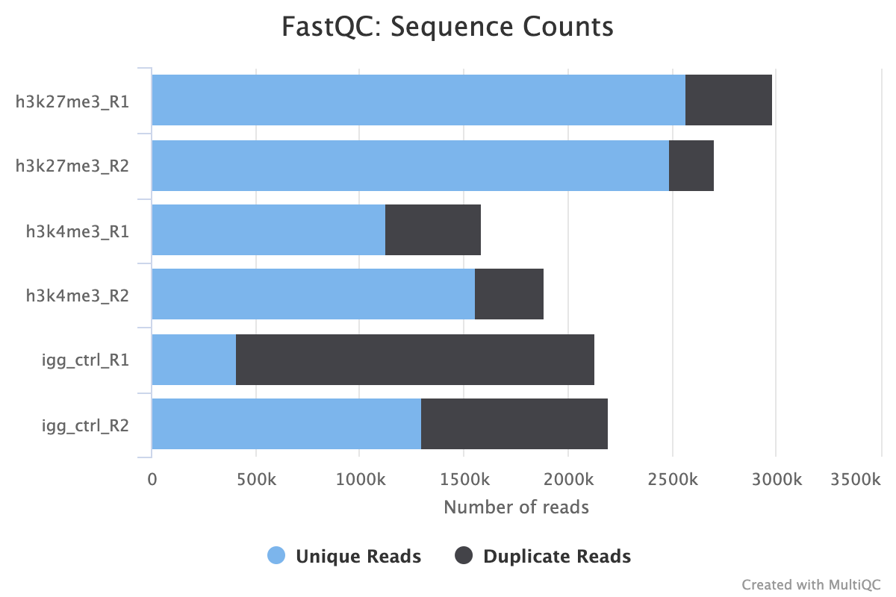

#### 2.4.1. Sequence Quality

FastQC provides several reports that look at sequence quality from different views. The mean quality scores plot shows the sequence quality along the length of the read. It is normal to see some drop off in quality towards the end of the read, especially with long-read sequencing (150 b.p.). The plot should be green and with modern sequencing on good quality samples, should be > 30 throughout the majority of the read. There are many factors that affect the read quality but users can expect drops in average score when working with primary tissue or other tissues that are difficult to sequence.

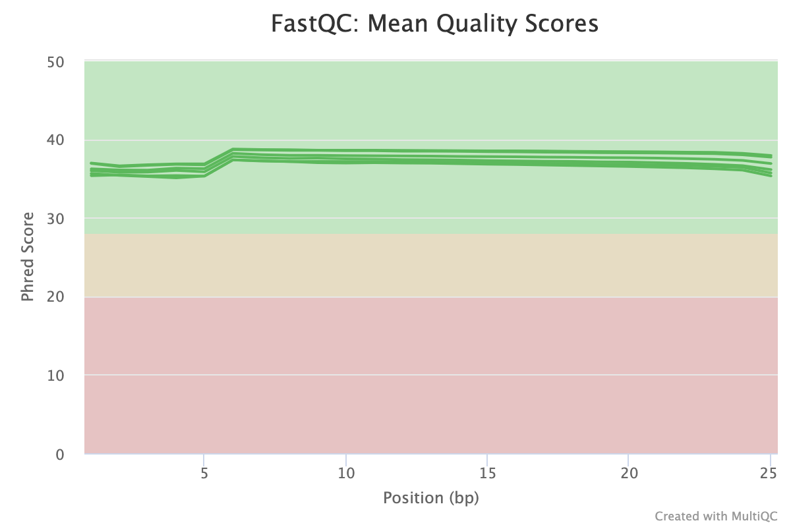

The Per-sequence quality score report shows a different view of sequencing quality, showing the distribution of scores for each sample. This chart will peak where the majority of the reads are scored. In modern Illumina sequencing this should be curve at the end of the chart in an area > 30.

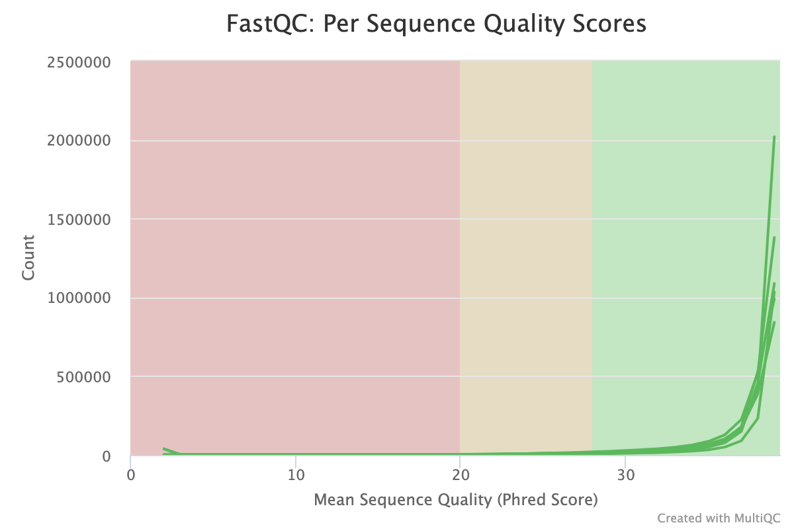

The Per-base sequence quality report is not applicable to CUT&RUN data generally. Any discordant sequence content at the beginning of the reads is a common phenomenon for CUT&RUN reads. Failing to pass the Per-base sequence content does not mean your data failed. It can be due to Tn5 preferential binding or what you might be detecting is the 10-bp periodicity that shows up as a sawtooth pattern in the length distribution. If so, this is normal and will not affect alignment or peak calling.

The Per-sequence GC content report shows the distribution of the GC content of all reads in a sample. This should be centred around the average GC content % for your target organism.

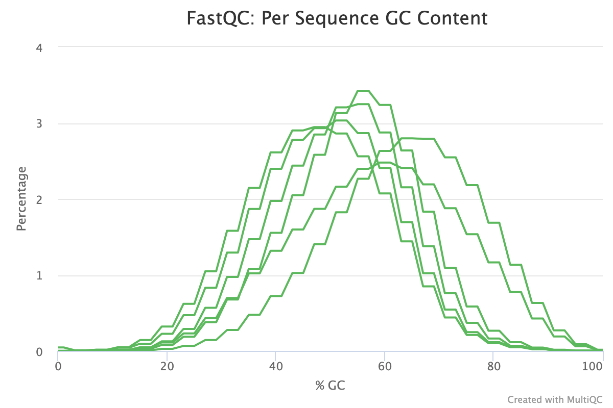

An unusually shaped distribution such as one with dual peaks could indicate a contaminated library or some other kind of biased subset. In the image below, we see a significant batch effect between two groups of samples run on different days. The samples in red most likely are contaminated with DNA that has a different GC content to that of the target organism.

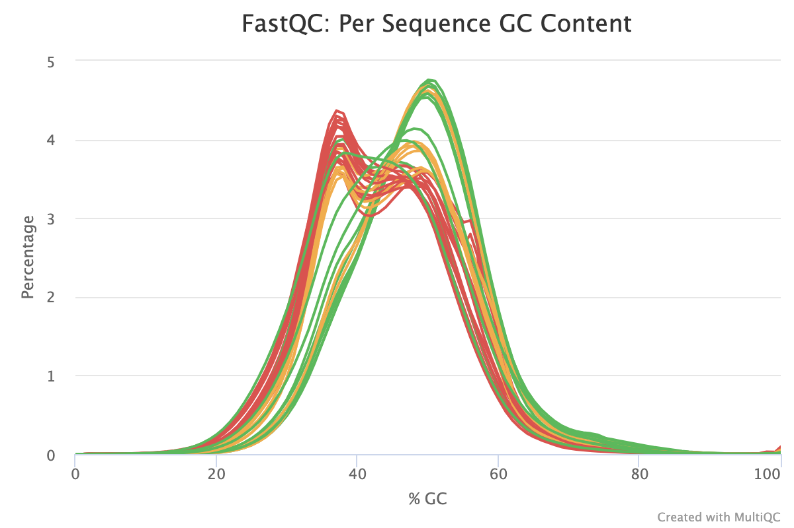

#### 2.4.2. Overrepresented Sequences

FastQC provides three reports that focus on overrepresented sequences at the read level. All three must be looked at both before and after trimming to gain a detailed view of the types of sequence duplication that your samples contain.

A normal high-throughput library will contain a diverse set of sequences with no individual sequence making up a large fraction of the whole library. Finding that a single sequence is overrepresented can be biologically significant, however it also often indicates that the library is contaminated, or is not as diverse as expected.

The sequence duplication level plot shows percentages of the library that has a particular range of duplication counts. For example, the plot below shows that for some samples ~10% of the library has > 100 duplicated sequences. While not particularly informative on its own, if problems are identified in subsequent reports, it can help to identify the scale of the duplication problem.

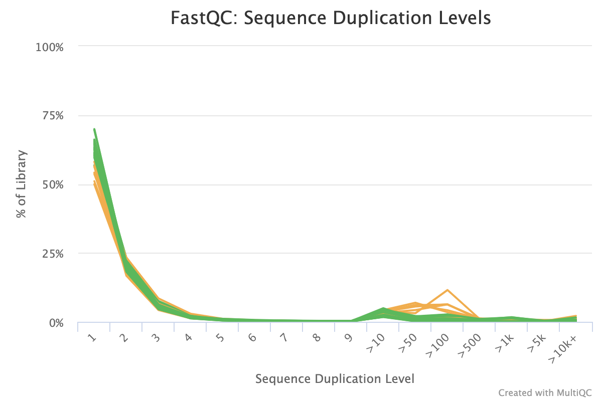

The second two reports must be analysed together both before and after trimming for maximum insight. The first report, overrepresented sequences, shows the percentage of identified sequences in each library; the second, adapter content, shows a cumulative plot of adapter content at each base position. Due to the short insert length for CUT&RUN, short read length sequencing (25 b.p.) is possible for samples; consequently, when the sequencing length increases, more of the sequencing adapters will be sequenced. Adapter sequences should always be trimmed off, therefore, it is important to look at both of these plots after trimming as well to check that the adapter content has been removed and there are only small levels of overrepresented sequences. A clear adapter content plot after trimming but where there are still significant levels of overrepresented sequences could indicate something biologically significant or experimental error such as contamination.

**A 25 b.p CUT&Tag experiment with clear reports even before trimming**

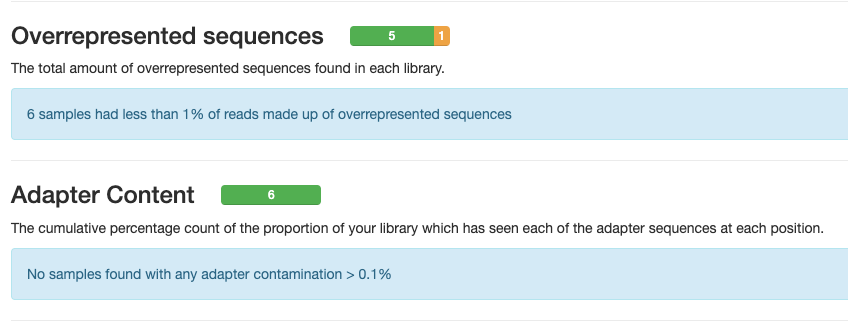

**A 150 b.p. CUT&RUN experiment with significant adapter content before trimming but that is clear after trimming**

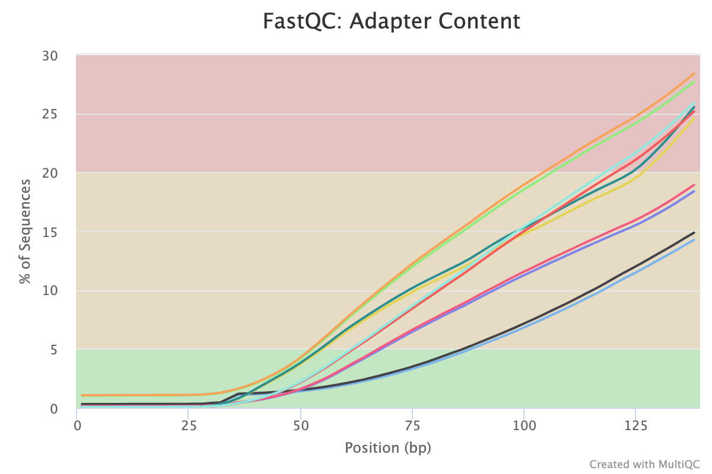

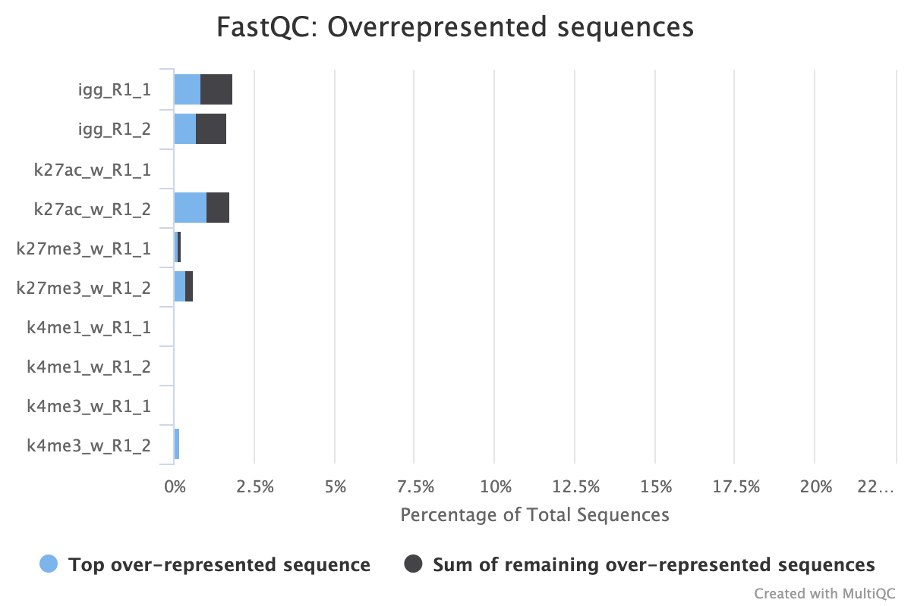

**After trimming**

**CUT&RUN experiment that shows over represented sequences even after trimming all the adapter content away**

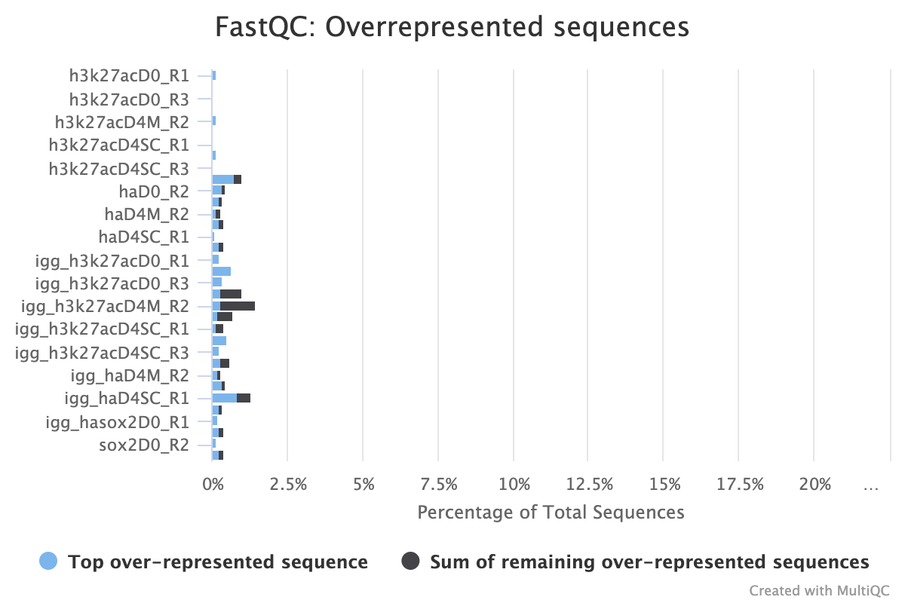

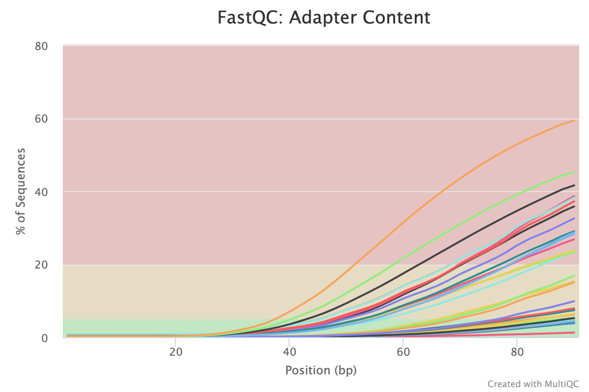

**After trimming**

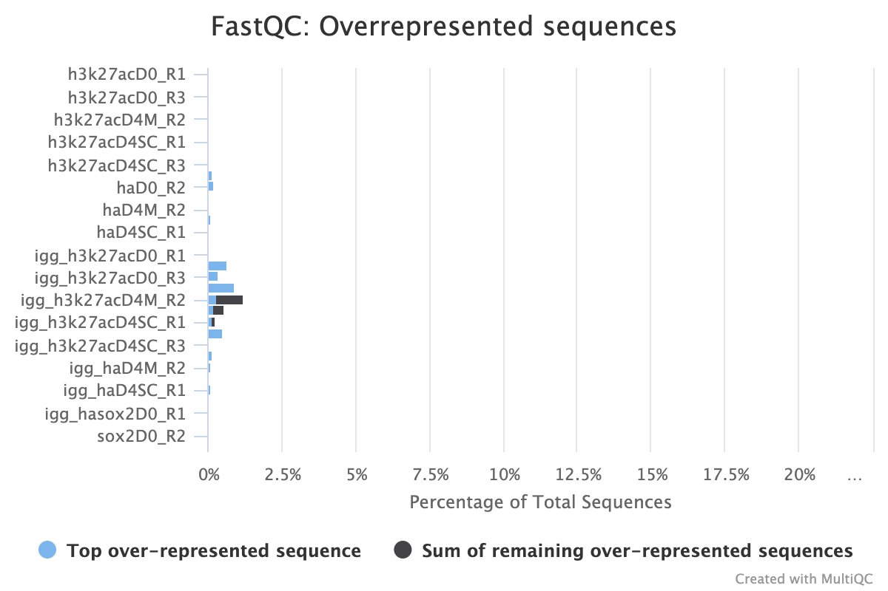

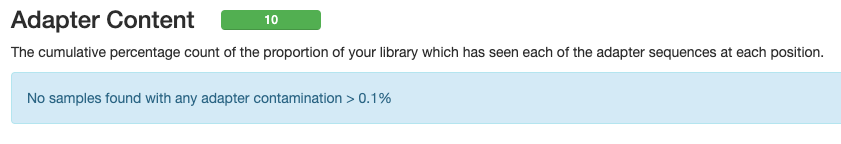

### 2.5. TrimGalore

Output files

- `01_prealign/trimgalore/`
  - `*.fq.gz`: If `--save_trimmed` is specified, FastQ files **after** adapter trimming will be placed in this directory.
  - `*_trimming_report.txt`: Log file generated by Trim Galore!.
- `01_prealign/trimgalore/fastqc/`
  - `*_fastqc.html`: FastQC report containing quality metrics for read 1 (_and read2 if paired-end_) **after** adapter trimming.
  - `*_fastqc.zip`: Zip archive containing the FastQC report, tab-delimited data file and plot images.

[Trim Galore!](https://www.bioinformatics.babraham.ac.uk/projects/trim_galore/) is a wrapper tool around Cutadapt and FastQC to perform quality and adapter trimming on FastQ files. By default, Trim Galore! will automatically detect and trim the appropriate adapter sequence.

> **NB:** TrimGalore! will only run using multiple cores if you are able to use more than > 5 and > 6 CPUs for single- and paired-end data, respectively. The total cores available to TrimGalore! will also be capped at 4 (7 and 8 CPUs in total for single- and paired-end data, respectively) because there is no longer a run-time benefit. See [release notes](https://github.com/FelixKrueger/TrimGalore/blob/master/Changelog.md#version-060-release-on-1-mar-2019) and [discussion whilst adding this logic to the nf-core/atacseq pipeline](https://github.com/nf-core/atacseq/pull/65).

**Typical plot showing many small sequences being trimmed from reads**

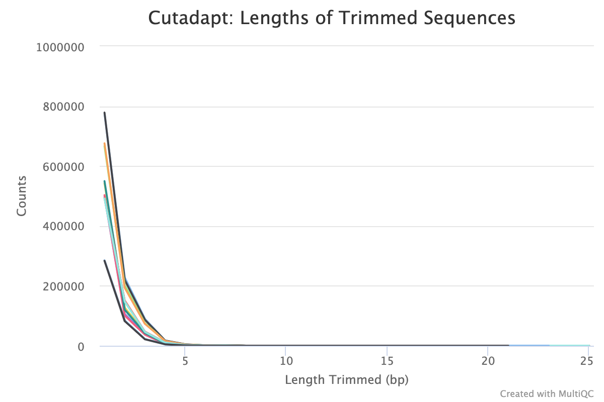

## 3. Alignment

### 3.1. Bowtie 2

Output files

- `02_alignment/bowtie2`

Adapter-trimmed reads are mapped to the target and spike-in genomes using [Bowtie 2](http://bowtie-bio.sourceforge.net/bowtie2/index.shtml). The pipeline will output the `.bam` files with index and samtools stats for only the final set by default. For example, the full pipeline will only output picard duplicates processed files as this is the final step before peak calling. If the pipeline is run with `--only_align`, then the `bam` files from the initial sorting and indexing will be copied to the output directory as the other steps are not run.

If `--save_align_intermed` is specified then all the `bam` files from all stages will be copied over to the output directory.

If `--save_spikein_aligned` is specified then the spike-in alignment files will also be published.

MultiQC shows several alignment-based reports however, the most important is the alignment score plot. A typical plot for a well-defined genome will look like the image below with high alignment scores and low levels of multi-mapped and unaligned sequences. Low levels of alignment can be due to a multitude of different factors but is generally a strong sign that the input library was of poor quality. That being said, if the total number of aligned reads is still above the required level for the target epitope abundance then it does not mean the sample has failed, as there still may be enough information to answer the biological question asked.

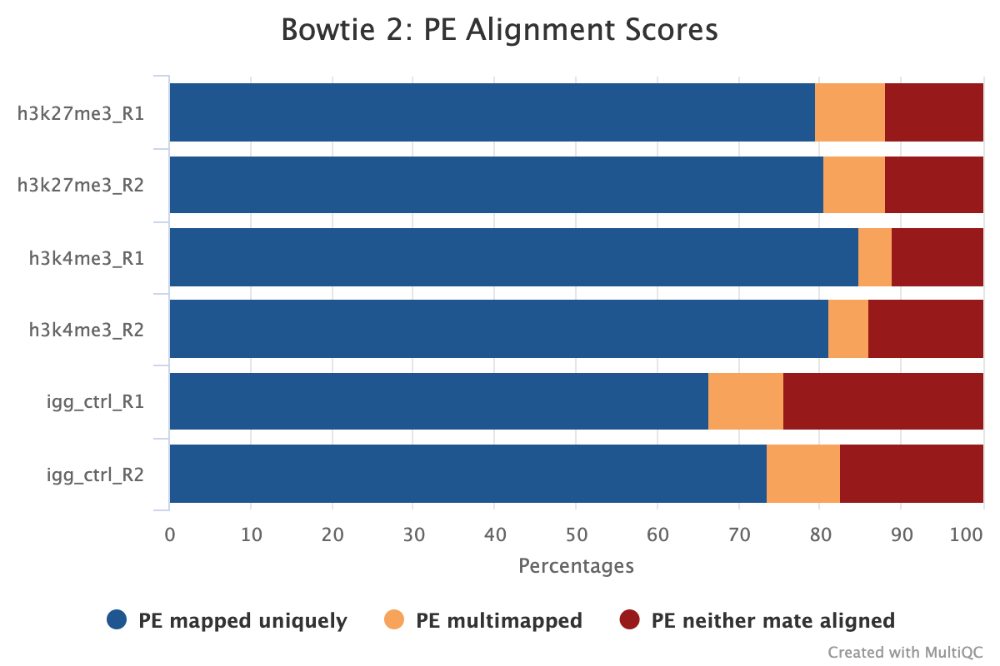

The MultiQC report also includes a spike-in alignment report. This plot is important for deciding whether to normalise your samples using the spike-in genome or by another method. The default mode in the pipeline is to normalise stacked reads before peak calling for epitope abundance using spike-in normalisation.

Traditionally, E. coli DNA is carried along with bacterially-produced enzymes that are used in CUT&RUN and CUT&Tag experiments and gets tagmented non-specifically during the reaction. The fraction of total reads that map to the E.coli genome depends on the yield of the epitope targeted, and so depends on the number of cells used and the abundance of that epitope in chromatin. Since a constant amount of protein is added to the reactions and brings along a fixed amount of E. coli DNA, E. coli reads can be used to normalise against epitope abundance in a set of experiments. This is assuming that the amount of E.coli and the numbers of cells is consistent between samples.

Since the introduction of these techniques there are several factors that have reduced the usefulness of this type of normalisation in certain experimental conditions. Firstly, many commercially available kits now have very low levels of E.coli DNA in them, which therefore requires users to spike-in their own DNA for normalisation which is not always done. Secondly the normalisation approach is dependant on the cell count between samples being constant, which in our experience is quite difficult to achieve especially in primary tissue samples.

The image below shows a typical plot for samples that have the correct amount of spike-in DNA for normalisation. The target samples have usually < 1% spike-in alignment (but still with > 1000 reads to reach above noise thresholds) while IgG should have the most as it has a large abundance (2-5%). In this example, the IgG will be brought inline with the other epitopes enabling proper peak calling using the IgG as a background.

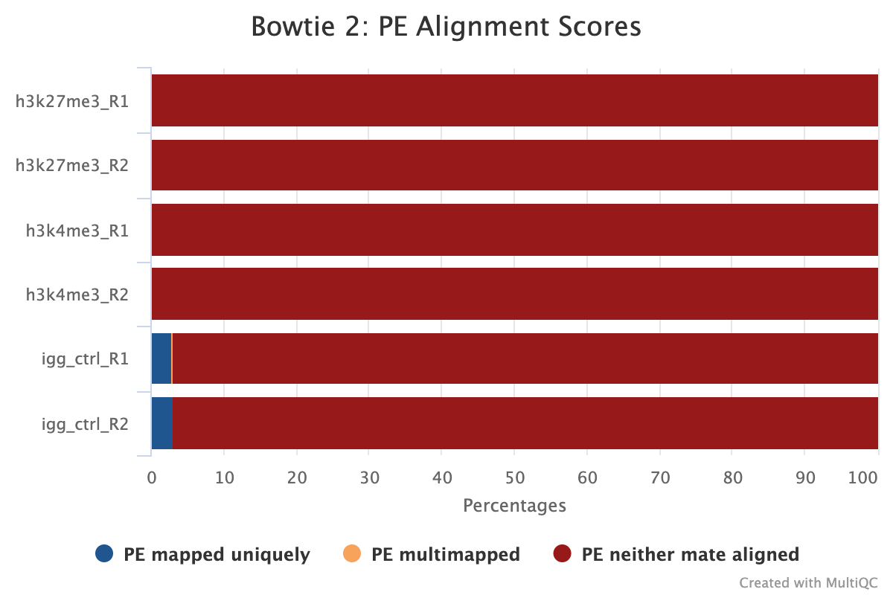

If you see very low spike-in levels for all samples, it is likely your Tn5 had no residual E.coli DNA and that no additional spike-in DNA was added. In this case spike-in normalisation cannot be used and normalisation must be switched to read count or no normalisation at all.

If you see a strange distribution of spike-in DNA alignment that does not fit with your knowledge of the relative abundance of your IgG and target epitopes, this is indicative of a problem with the spike-in process and again, another normalisation option should be chosen.

In the plot below, it may initially look as though the spike-in distribution is too varied to be useful however, the larger IgG spike-in alignment counts correspond to the target samples with more sequencing depth and more spike-in alignments; therefore, these samples are actually good candidates for spike-in normalisation.

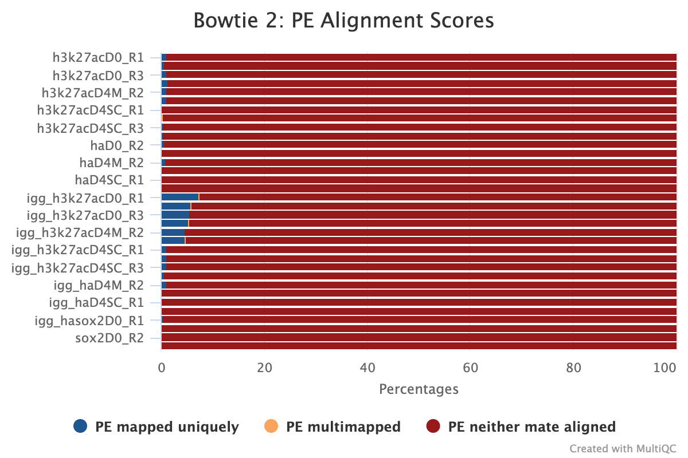

### 3.2. Library Complexity

To estimate library complexity and identify potentially over-sequenced libraries (or libraries with a low information content) we run preseq. [Library Complexity](http://smithlabresearch.org/software/preseq/) estimates the complexity of a library, showing how many additional unique reads are sequenced for increasing total read count. A shallow curve indicates complexity saturation. The dashed line shows a perfectly complex library where total reads = unique reads.

The plot below shows a group of samples where the majority of unique molecules are accounted for by 50M. The total molecules detected stretches beyond 250M indicating the library is over sequenced and that an identical future experiment could be sequenced to a lower depth without loosing information.

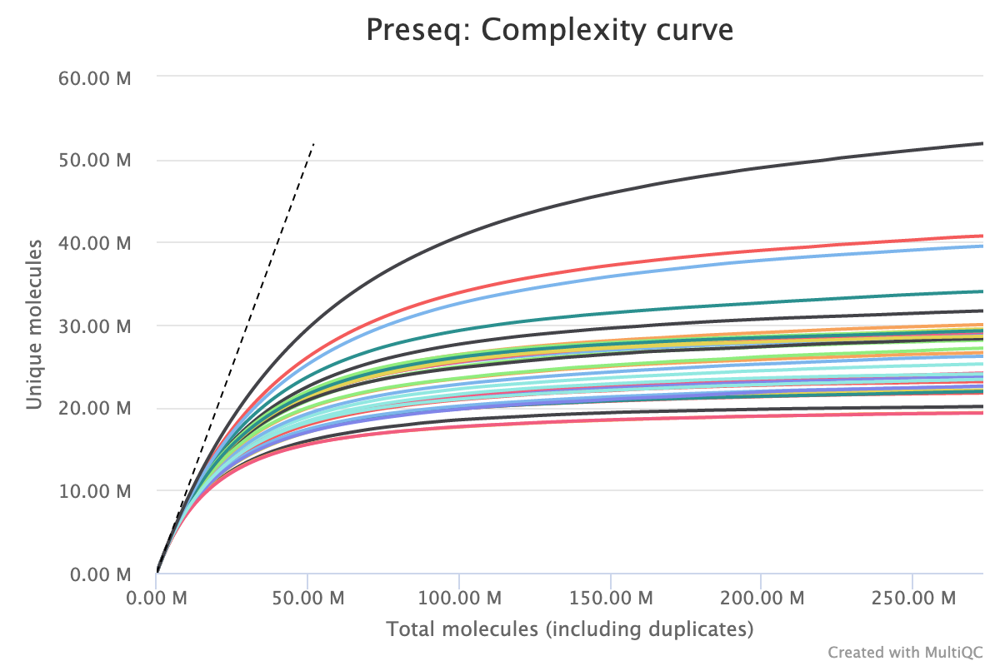

## 4. Alignment post-processing

### 4.1. Quality Filtering

BAM files are filtered for a minimum quality score, mitochondrial reads (if necessary) and for fully mapped reads using [SAMtools](http://samtools.sourceforge.net/). These results are then passed on to Picard for duplicate removal.

### 4.2. PICARD MarkDuplicates/RemoveDuplicates

Output files

- `02_alignment/bowtie2/target/markdup/`
  - `.markdup.bam`: Coordinate sorted BAM file after duplicate marking. This is the final post-processed BAM file and so will be saved by default in the results directory.
  - `.markdup.bam.bai`: BAI index file for coordinate sorted BAM file after duplicate marking. This is the final post-processed BAM index file and so will be saved by default in the results directory.
- `02_alignment/bowtie2/target/markdup/picard_metrics`
  - `.markdup.MarkDuplicates.metrics.txt`: Metrics file from MarkDuplicates.

By default, the pipeline uses [picard MarkDuplicates](https://broadinstitute.github.io/picard/command-line-overview.html#MarkDuplicates) to _mark_ the duplicate reads identified amongst the alignments to allow you to gauge the overall level of duplication in your samples.

If your data includes IgG controls, these will additionally be de-duplicated. It is not the normal protocol to de-duplicate the target reads, however, if this is required, use the `--dedup_target_reads true` switch.

The plot below shows a typical CUT&Tag experiment that has its PCR cycles optimised. We see a low level of non-optical duplication (from library amplification) in the target samples but more in the IgG samples as the reads in these samples derive from non-specific tagmentation in the CUT&Tag reactions.

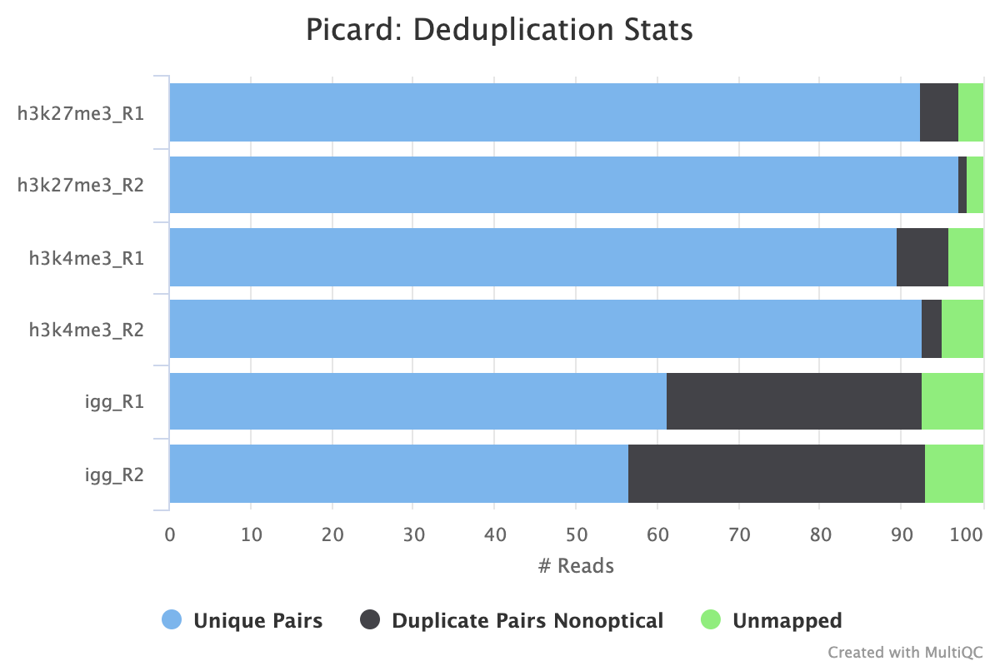

High levels of duplication are not necessarily a problem as long as they are consistent across biological replicates or other comparable groups. Given that the target samples are not de-duplicated by default, if the balance of duplicate reads is off when comparing two samples, it may lead to inaccurate peak calling and subsequent spurious signals. High levels of non-optical duplication are indicative of over-amplified samples.

### 4.3. Removal of Linear Amplification Duplicates

Output files

- `02_alignment/bowtie2/target/la_duplicates/`
  - `.la_dedup.bam`: Coordinate sorted BAM file after Linear Amplification duplicate removal. This is the final post-processed BAM file and so will be saved by default in the results directory.
  - `.la_dedup.bam.bai`: BAI index file for coordinate sorted BAM file after Linear Amplification duplicate removal. This is the final post-processed BAM index file and so will be saved by default in the results directory.
  - `.la_dedup_metrics.txt`: Metrics file from custom deduplication based on read 1 5' start location.

In assays where linear amplification is used, the resulting library may contain reads that share the same start site but have a unique 3' end due to random cut and tagmentation with Tn5-ME-B. In this case, these duplicates should be removed by filtering all read 1's based on their 5' start site and keeping the read aligning with the highest mapping quality.

## 5. Fragment-based QC

This section of the pipeline deals with quality control at the aligned fragment level. The read fragments are counted by binning them into regions genome-wide. The default is 500 b.p. but this can be changed using `dt_qc_bam_binsize`. All of the plots shown below are calculated from this initial binned data-set.

### 5.1. PCA

Descriptions taken from the deepTools [manual]([plotFingerprint — deepTools 3.5.0 documentation](https://deeptools.readthedocs.io/en/develop/content/tools/plotFingerprint.html))

Principal component analysis (PCA) can be used, for example, to determine whether samples display greater variability between experimental conditions than between replicates of the same treatment. PCA is also useful to identify unexpected patterns, such as those caused by batch effects or outliers. Principal components represent the directions along which the variation in the data is maximal, so that the information from thousands of regions can be represented by just a few dimensions.

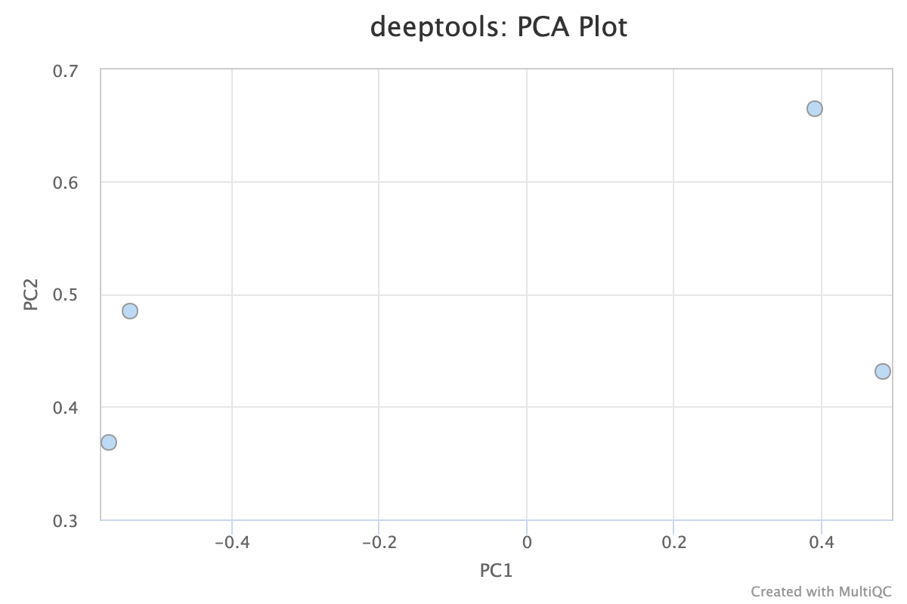

### 5.2. Fingerprint

Descriptions taken from the deepTools [manual](https://deeptools.readthedocs.io/en/develop/content/tools/plotFingerprint.html)

This tool is based on a method developed by [Diaz et al.](http://www.ncbi.nlm.nih.gov/pubmed/22499706). It determines how well the signal in the CUT&RUN/Tag sample can be differentiated from the background distribution of reads in the control sample. For factors that exhibit enrichment of well-defined and relatively narrow regions (e.g. transcription factors such as p300), the resulting plot can be used to assess the strength of a CUT&RUN experiment. However, when broad regions of enrichment are to be expected, the less clear the plot will be. Vice versa, if you do not know what kind of signal to expect, the fingerprint plot will give you a straight-forward indication of how careful you will have to be during your downstream analyses to separate noise from meaningful biological signal.

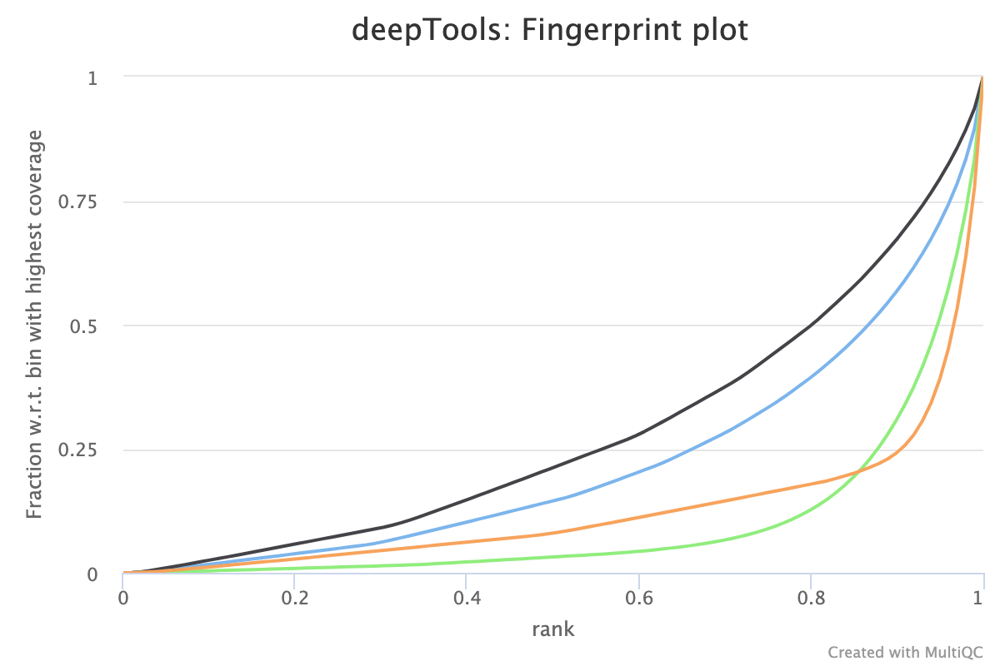

### 5.3. Correlation

Descriptions taken from the deepTools [manual](https://deeptools.readthedocs.io/en/develop/content/tools/plotCorrelation.html)

Computes the overall similarity between two or more samples based on read coverage within genomic regions. The result of the correlation computation is a table of correlation coefficients that indicates how “strong” the relationship between two samples is (values are between -1 and 1: -1 indicates perfect anti-correlation, 1 perfect correlation.)

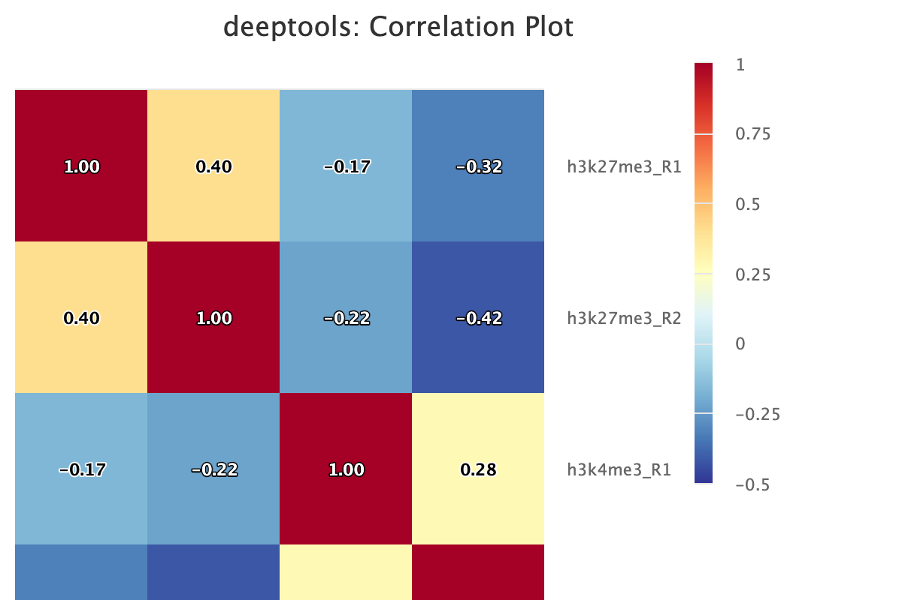

## 6. Peak Calling

### 6.1. Bam to bedgraph

Output files

- `03_peak_calling/01_bam_to_bedgraph`
  - `*.bedgraph`: bedgraph coverage file.

Converts bam files to the bedgraph format.

### 6.2. Bed to bigwig

Output files

- `03_peak_calling/03_bed_to_bigwig`
  - `*.bigWig`: bigWig coverage file.

The [bigWig](https://genome.ucsc.edu/goldenpath/help/bigWig.html) format is an indexed binary format useful for displaying dense, continuous data in Genome Browsers such as the [UCSC](https://genome.ucsc.edu/cgi-bin/hgTracks) and [IGV](http://software.broadinstitute.org/software/igv/). This mitigates the need to load the much larger BAM files for data visualisation purposes which will be slower and result in memory issues. The bigWig format is also supported by various bioinformatics software for downstream processing such as meta-profile plotting.

### 6.3. SEACR peak calling

Output files

- `03_peak_calling/04_called_peaks/`
  - BED file containing peak coordinates and peak signal.

[SEACR](https://github.com/FredHutch/SEACR) is a peak caller for data with low background-noise, so is well suited to CUT&Run/CUT&Tag data. SEACR can take in IgG control bedGraph files in order to avoid calling peaks in regions of the experimental data for which the IgG control is enriched. If `--use_control false` is specified, SEACR calls enriched regions in target data by selecting the top 5% of regions by AUC by default. This threshold can be overwritten using `--seacr_peak_threshold`.

### 6.4. MACS2 peak calling

- `03_peak_calling/04_called_peaks/`
  - BED file containing peak coordinates and peak signal.

MACS2 is a peak caller used in many other experiments such as ATAC-seq and ChIP-seq. It can deal with high levels of background noise but is generally less sensitive than SEACR. If you are having trouble calling peaks in SEACR, we recommend switching to this peak caller, especially if your QC is saying that you have a high level of background noise.

MACS2 has its main parameters exposed through the pipeline configuration. The default p-values and genome size can be changed using the `--macs2_pvalue` and `--macs2_gsize` parameters. MACS2 has two calling modes: narrow and broad peak. We recommend using broad peak for epitopes with a wide peak range such as histone marks, and narrow peak for small binding proteins such as transcription factors. This mode can be changed using `--macs2_narrow_peak`.

### 6.5. Consensus Peaks

The merge function from [BEDtools](https://github.com/arq5x/bedtools2) is used to merge replicate peaks of the same experimental group to create a consensus peak set. This can then optionally be filtered for consensus peaks contributed to be a threshold number of replicates using `--replicate_threshold`.

## 7. Peak-based QC

Once the peak calling process is complete, we run a separate set of reports that analyse the quality of the results at the peak level.

### 7.1. Peak Counts

For both the sample peaks and the consensus peaks, a simple count is taken. At the sample level, it is important to see consistency between peak counts of biological replicates. It is the first indicator of whether you replicates samples agree with each other after all of the processing has completed. If you use the consensus peaks and use a replicate threshold of more than 1, it is also important to see how many of your peaks across replicates have translated into consensus peaks.

In the image below we see comparable peak counts for the H3K27me3 dataset, but a large disparity for the H3K4me3.

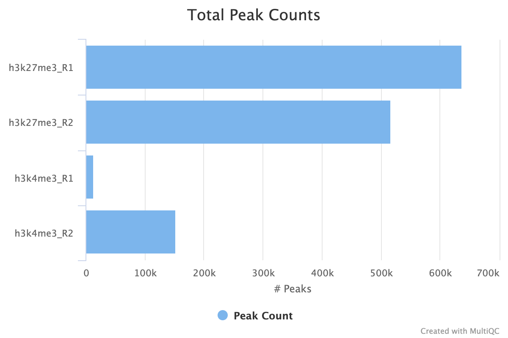

### 7.2. Peak Reproducibility

The peak reproducibility report intersects all samples within a group using `bedtools intersect` with a minimum overlap controlled by `min_peak_overlap`. This report is useful along with the peak count report for estimating how reliable the peaks called are between your biological replicates.

For example, in the image below when combined with the peak count information we see that although the H3K27me3 replicates both have similar peak counts, < 30% of the peaks are replicated across the replicate set. For H3K4me3, we see that replicate 1 has a small number of peaks called, but that almost 100% of those peaks are replicated in the second replicate. Replicate 2 has < 20% of its replicates reproduced in replicate 1 but by looking at the peak counts we can see this is due to the low number of peaks called.

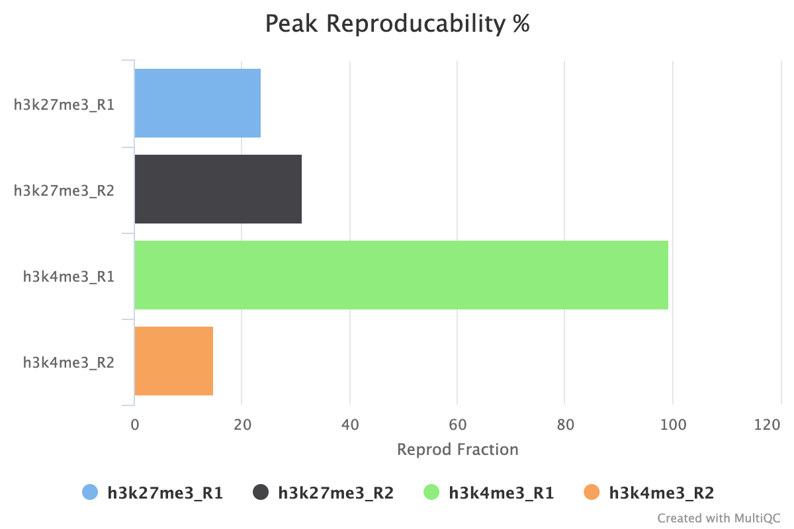

### 7.3. FRiP Score

Fraction of fragments in peaks (FRiP), defined as the fraction of all mapped paired-end reads extended into fragments that fall into the called peak regions, i.e. usable fragments in significantly enriched peaks divided by all usable fragments. In general, FRiP scores correlate positively with the number of regions. (Landt et al, Genome Research Sept. 2012, 22(9): 1813–1831). A minimum overlap is controlled by `min_frip_overlap`. The FRiP score can be used to assess the overall quality of a sample. Poor samples with a high level of background noise, small numbers of called peaks or other issues will have a large number of fragments falling outside the peaks that were called. Generally FRiP scores > 0.3 are considered to be reasonable with the highest quality data having FRiP scores of > 0.7.

It is worth noting that the peak caller settings are also crucial to this score, as even the highest quality data will have a low FRiP score if the pipeline is parameterised in a way that calls few peaks, such as setting the peak calling threshold very high.

## 8. Fragment Length Distribution

CUT&Tag inserts adapters on either side of chromatin particles in the vicinity of the tethered enzyme, although tagmentation within chromatin particles can also occur. So, CUT&Tag reactions targeting a histone modification predominantly results in fragments that are nucleosomal lengths (~180 bp), or multiples of that length. CUT&Tag targeting transcription factors predominantly produce nucleosome-sized fragments and variable amounts of shorter fragments, from neighbouring nucleosomes and the factor-bound site, respectively. Tagmentation of DNA on the surface of nucleosomes also occurs, and plotting fragment lengths with single-basepair resolution reveal a 10-bp sawtooth periodicity, which is typical of successful CUT&Tag experiments.

**NB:** Experiments targeting transcription factors may produce different fragment distributions depending on factors beyond the scope of this article.

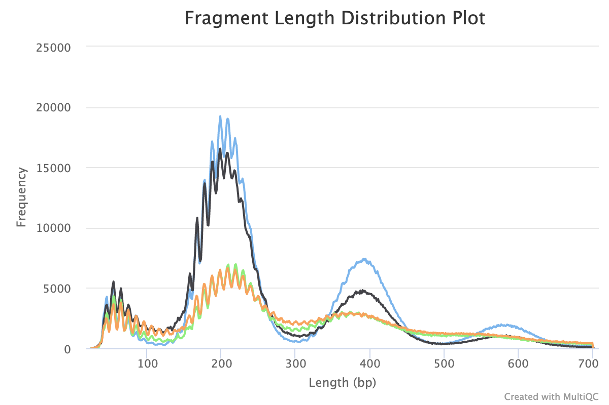

### 8.1. Heatmaps

Heatmaps for both genomic features and peaks are generated using deepTools. The parameters for the gene heatmap generation including kilobases to map before and after the gene body can be found with the prefix `dt_heatmap_gene_*`. Similarly, the peak-based heatmap parameters can be found using `dt_heatmap_peak_*`.

**NB:** These reports are generated outside of MultiQC

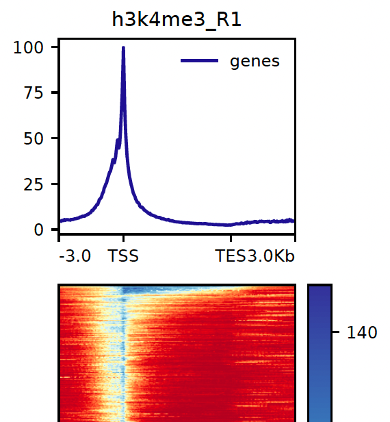

### 8.2. Upset Plots

Upset plots provide a different view on which sets of peaks are overlapping across different samples. Use in conjunction with the other peak-based QC metrics.

**NB:** These reports are generated outside of MultiQC

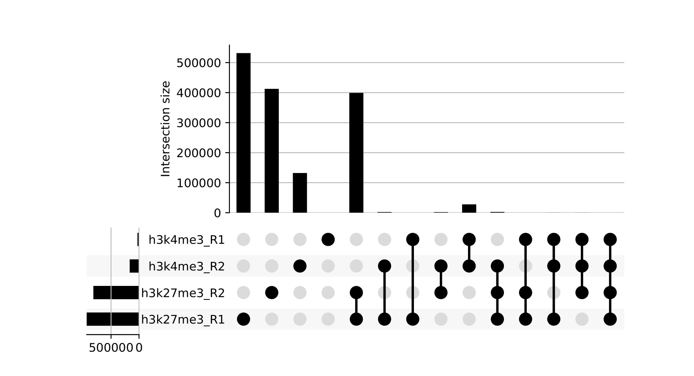

### 8.3. IGV

An IGV session file will be created at the end of the pipeline containing the normalised bigWig tracks, per-sample peaks, target genome fasta and annotation GTF. Once installed, open IGV, go to File > Open Session and select the `igv_session.xml` file for loading.

> **NB:** If you are not using an in-built genome provided by IGV you will need to load the annotation yourself e.g. in .gtf and/or .bed format.

## 9. Workflow reporting and genomes

### 9.1. Reference genome files

Output files

- `00_genome/target/`
  - `*.fa`: If the `--save_reference` parameter is provided then all of the genome reference files will be placed in this directory.
- `00_genome/target/index/`
  - `bowtie2`: Directory containing target Bowtie2 indices.
- `00_genome/spikein/index/`
  - `bowtie2`: Directory containing spike-in Bowtie2 indices.

A number of genome-specific files are generated by the pipeline because they are required for the downstream processing of the results. If the `--save_reference` parameter is provided then these will be saved in the `00_genome/` directory. It is recommended to use the `--save_reference` parameter if you are using the pipeline to build new indices so that you can save them somewhere locally. The index building step can be quite a time-consuming process and it permits their reuse for future runs of the pipeline to save disk space.

### 9.2. Pipeline information

Output files

- `pipeline_info/`
  - Reports generated by Nextflow: `execution_report.html`, `execution_timeline.html`, `execution_trace.txt` and `pipeline_dag.dot`/`pipeline_dag.svg`.
  - Reports generated by the pipeline: `pipeline_report.html`, `pipeline_report.txt` and `software_versions.yml`. The `pipeline_report*` files will only be present if the `--email` / `--email_on_fail` parameter's are used when running the pipeline.
  - Reformatted samplesheet files used as input to the pipeline: `samplesheet.valid.csv`.
  - Parameters used by the pipeline run: `params.json`.

[Nextflow](https://www.nextflow.io/docs/latest/tracing.html) provides excellent functionality for generating various reports relevant to the running and execution of the pipeline. This will allow you to troubleshoot errors with the running of the pipeline, and also provide you with other information such as launch commands, run times and resource usage.
